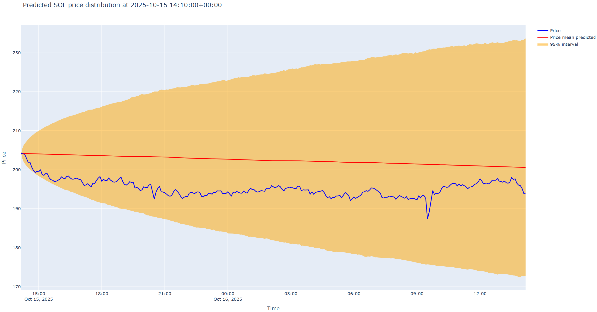

# Condor Game

Condor game is a probabilistic forecasting challenge hosted by CrunchDAO at [crunchdao.com](https://crunchdao.com)

The goal is to anticipate how asset prices will evolve by providing not a single forecasted value, but a full probability distribution over future log-returns.

## Install

```bash
pip install condorgame
```

## What You Must Predict

Trackers must predict the **probability distribution of log-return price changes**, defined as:

$$
r_t = \log(P_t) - \log(P_{t-1})
$$

For each future step (e.g., +5 minutes, +10 minutes, …), your tracker must return a **probability density function (PDF)** describing where the **future log-return** is likely to be.


## Visualize the challenge

The Condor game is evaluated on **log-return predictions**, not raw prices.  
Log-returns capture the *relative* change in price and produce a stationary series that is easier to model and compare across assets.

Below is an example of a **density forecast over log-returns for the next 24h at 5-minute intervals**:


Below is a minimal example showing what your tracker might return:
```python
>>> model.predict(asset="SOL", horizon=86400, step=300)
[
    {
        "step": (k + 1) * step,
        "prediction": {
            "type": "builtin",
            "name": "norm",
            "params": {
                "loc": -4e-5,       # mean log-return
                "scale": 0.0067     # standard deviation of log-return
            }
        }
    }
    for k in range(0, horizon // step)
]
```

Here is the **log-return forecast mapped into price space**:




## Create your Tracker

A tracker is a model that processes real-time asset data to predict future price changes. It uses past prices to generate a probabilistic forecast of log-returns. You can use the data provided by the challenge or any other datasets to improve your predictions.

To create your tracker, you need to define a class that implements the `TrackerBase` interface. Specifically, your class must implement the following methods:

1. **`tick(self, data: PriceData)`**  
   This method is called whenever new price data arrives. Use this method to update your internal state or model.

   Data example:
     ```python
      data = {
            "BTC": [(timestamp1, price1), (timestamp2, price2)],
            "SOL": [(timestamp1, price1)],
        }
     ```
2. **`predict(self, asset: str, horizon: int, step: int)`**  
   This method should return a sequence of density predictions for the asset's price changes (log-returns). Each density prediction must comply with the [density_pdf](https://github.com/microprediction/densitypdf/blob/main/densitypdf/__init__.py) specification.

You can refer to the [Tracker examples](condor_forecast/examples) for guidance.

```python
class GaussianStepTracker(TrackerBase):
    """
    A benchmark tracker that models *future log-returns* as Gaussian-distributed.

    For each forecast step k, the tracker returns a normal distribution
    N(mu, sigma) where:
        - mu    = mean historical log-return
        - sigma = std historical log-return

    This is NOT a price-distribution; it is a distribution over log-returns
    between consecutive steps.
    """
    def __init__(self):
        super().__init__()

    # The `tick` method is inherited from TrackerBase.
    # override it if your tracker requires custom update logic

    def predict(self, asset: str, horizon: int, step: int):
        # Retrieve past prices with sampling resolution equal to the prediction step.
        pairs = self.prices.get_prices(asset, days=5, resolution=step)
        if not pairs:
            return []
        _, past_prices = zip(*pairs)

        # Compute historical log-returns
        log_prices = np.log(past_prices)
        returns = np.diff(log_prices)

        # Estimate drift (mean log-return) and volatility (std dev of log-returns)
        mu = float(np.mean(returns))
        sigma = float(np.std(returns))

        num_segments = horizon // step

        # Produce one Gaussian for each future time step
        # The returned list must be compatible with the `density_pdf` library.
        distributions = []
        for k in range(1, num_segments + 1):
            distributions.append({
                "step": k * step,
                "type": "mixture",
                "components": [{
                    "density": {
                        "type": "builtin",
                        "name": "norm",  
                        "params": {"loc": mu, "scale": sigma}
                    },
                    "weight": 1
                }]
            })

        return distributions
```

## Check your Tracker performance

TrackerEvaluator allows you to track your model's performance over time locally before participating in the live game. It maintains:

- Overall likelihood score
- Recent likelihood score
- Quarantine predictions (predictions stored and evaluated at a later time)

**A higher likelihood score reflects more accurate predictions.**

```python
from condorgame.tracker_evaluator import TrackerEvaluator
from condorgame.examples.benchmarktracker import GaussianStepTracker  # Your custom tracker

tracker_evaluator = TrackerEvaluator(GaussianStepTracker())
tracker_evaluator.tick({"SOL": [(ts, price)]})
predictions = tracker_evaluator.predict("SOL", horizon=86400, step=300)

print(f"My overall likelihood score: {tracker_evaluator.overall_likelihood_score():.4f}")
print(f"My recent likelihood score: {tracker_evaluator.recent_likelihood_score():.4f}")
```


## Tracker examples 
See [Tracker examples](condorgame/examples). There are:

- Quickstarter Notebooks
- Self-contained examples


## General Condor Game Advice 

The Condor game challenges you to predict the asset location using probabilistic forecasting.

### Probabilistic Forecasting

Probabilistic forecasting provides **a distribution of possible future values** rather than a single point estimate, allowing for uncertainty quantification. Instead of predicting only the most likely outcome, it estimates a range of potential outcomes along with their probabilities by outputting a **probability distribution**.

A probabilistic forecast models the conditional probability distribution of a future value $(Y_t)$ given past observations $(\mathcal{H}_{t-1})$. This can be expressed as:  

$$P(Y_t \mid \mathcal{H}_{t-1})$$

where $(\mathcal{H}_{t-1})$ represents the historical data up to time $(t-1)$. Instead of a single prediction $(\hat{Y}_t)$, the model estimates a full probability distribution $(f(Y_t \mid \mathcal{H}_{t-1}))$, which can take different parametric forms, such as a Gaussian:

$$Y_t \mid \mathcal{H}_{t-1} \sim \mathcal{N}(\mu_t, \sigma_t^2)$$

where $(\mu_t)$ is the predicted mean and $(\sigma_t^2)$ represents the uncertainty in the forecast.

Probabilistic forecasting can be handled through various approaches, including **variance forecasters**, **quantile forecasters**, **interval forecasters** or **distribution forecasters**, each capturing uncertainty differently.

For example, you can try to forecast the target location by a gaussian density function (or a mixture), thus the model output follows the form:

```python
{
   "density": {
      "name": "normal",
      "params": {"loc": y_mean, "scale": y_var}
   },
   "weight": weight
}
```

A **mixture density**, such as the gaussion mixture $\sum_{i=1}^{K} w_i \mathcal{N}(Y_t | \mu_i, \sigma_i^2)$ allows for capturing multi-modal distributions and approximate more complex distributions.


### Additional Resources

- [Literature](LITERATURE.md) 
- Useful Python [packages](PACKAGES.md)